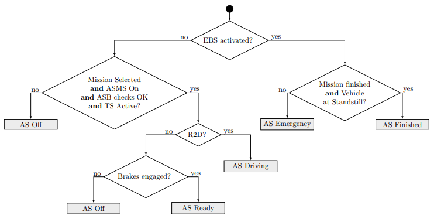

# FSBDriverless

## MANUAL DE LA MAQUINA DE ESTADOS DRIVERLESS 

Para poder ejecutar este archivo, se necesitan los siguientes recursos:
### 1. Instalacion de ROS en WSL. 

En nuestro caso vamos a ver para instalar ros en WSL para poder ejecutar el simulador correctamente y asi poder trabajar sin necesidad del hardware fisico.
Lo primero sera instalar ubuntu, en este caso se podra instalar el WSL desde windows store, buscaremos por ubuntu 18.0 ya que es la ultima version que funciona con Ros melodic
Desde la web de [ROS](http://wiki.ros.org/melodic/Installation) tenemos diferentes opciones para instalar, 

En nuestro caso seleccionarios ubuntu y seria seguir los pasos.

  sudo sh -c 'echo "deb http://packages.ros.org/ros/ubuntu $(lsb_release -sc) main" > /etc/apt/sources.list.d/ros-latest.list'
 ``` 
 sudo apt install curl
 curl -s https://raw.githubusercontent.com/ros/rosdistro/master/ros.asc | sudo apt-key add -
 sudo apt update
 sudo apt install ros-melodic-desktop-full
 echo "source /opt/ros/melodic/setup.bash" >> ~/.bashrc
 source ~/.bashrc
 sudo apt install python-rosdep python-rosinstall python-rosinstall-generator python-wstool build-essential
```
Con esto tendriamos ya ros instado y listo para usar.
### 2. Visualizacion de herramientas de ROS con gui en windows 10 y WSL

Si se dispone Windows 11 y WSL2.0 no hara falta nada ya que de forma nativa se pueden ejecutar las app de GUI de linux nativamente.

Para el resto habra que instalar un servidor X11 para que poder visualizarlo en linux.
### 3. Python 3

Para ejecutar el archivo se utilizara Python 3.
```
sudo apt install python3
```
Habra que tener instalados los siguientes paquetes:
- Tkinter: Se utilizara para la visualización grafica
```
sudo apt-get install python3-tk
```
- Rospy: Para hacer la conexión con ROS
```
sudo apt-get install python-rospy
sudo apt install python-std-msgs
```
## EJECUCIÓN

El archivo **Maquina_Estados_UI.py**, sera un nodo de ROS, el cual actualizara el estado actual de el sistema Driverless dependiendo de los parametros introducidos desde la interfaz grafica. Cuando se pulse el boton de actualizar, los parametros introducidos se publicaran siguiendo el diagrama de estados dado por la normativa de la competición:



Para iniciar el proceso, simplemente tendremos que ejecutar el archivo usando python.
```
python Maquina_Estados_UI.py
```
